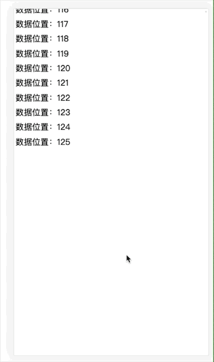

## JS高性能渲染大量数据

> 假设现在有 10w 条数据需要渲染到页面上(当然正常业务中我们不会这样做)，我们需要哪些知识点进行优化呢？

- 知识点：Event Loop、FPS、requestAnimationFrame

### 粗暴方式

> 一次性将数据 push 到页面上，看 demo

```
// html
<div id="root"></div>

// js
var number = 100000;
var html = '';
var rootDom = document.getElementById('root');
var now = Date.now();

for (i = 0; i < number; i++) {
  html += `<p>数据位置：${i+1}</p>`;
}
rootDom.innerHTML = html;

console.log(`JS运行时间：${Date.now() - now}ms`);

setTimeout(()=> {
  console.log(`页面渲染时间：${Date.now() - now}ms`);
},0);

// 控制台输出
JS运行时间：197ms
页面渲染时间：2171ms
```

- Event Loop
	- js 在[堆栈](https://jakearchibald.com/2015/tasks-microtasks-queues-and-schedules/)中管理的事务全部执行结束后，才会进行渲染操作。
	- 第一次的 console 在页面渲染前，此时得出的时间是 js 运行时间。
	- 第二次的 console 在页面渲染之后，此时得出的时间是总渲染时间。
		- 由于 setTimeout 的异步特性，导致 callback 中的 console 会在渲染结束后的下一次 Event Loop 中执行。
- 总结：js 的运算并不是性能瓶颈，而渲染才是真正需要进行优化的部分。

### 分批渲染

> 使用定时器进行分批渲染

```
// html
<div id="root"></div>

// js
const number = 100000;
const rootDom = document.getElementById('root');
let once = 1000; // 一次插入多少条
let index = 0; // 当前索引
//循环加载数据
function loop(curTotal, curIndex){
  if(curTotal <= 0){
    return false;
  }
  //每页多少条
  let pageCount = Math.min(curTotal , once);
  setTimeout(() => {
    for(let i = 0; i < pageCount; i++){
      let p = document.createElement('p');
      p.innerText = `数据位置：${curIndex + i}`;
      rootDom.appendChild(p)
    }
    loop(curTotal - pageCount, curIndex + pageCount);
  },0)
}
loop(number, index);
```

我们用 gif 来看下效果



使用定时器的方式我们能很快的看到首屏数据，但是快速滚动页面时，会发现有闪烁。

### 闪烁原因

> 当我们在玩大型游戏时，由于机器原因或者网络原因，我们或多或少都会遇到卡帧的情况，也就是画面一卡一卡的。也就是我们经常说的 FPS 太低了。

- [什么是FPS](https://baike.baidu.com/item/FPS/3227416)
- 现在一般的显示器为 60HZ，也就是每秒刷新60次，那么每次刷新时间就是 `1000ms/60次 = 16.7ms/次`；好些的能达到 75HZ，那么每次刷新时间就是 `13.33ms/次`。
- 在达到 60HZ 以上的频率时，我们将不会感觉到闪烁，也就是画面会非常的流畅。
- 在上面的例子中，我们使用定时器进行刷新，但是由于堆栈处理事务的时间是不确定的，当出现程序的刷新时间与显示器的刷新频率不符时，就会出现闪烁的情况。

### 使用 requestAnimationFrame

- [MDN](https://developer.mozilla.org/zh-CN/docs/Web/API/Window/requestAnimationFrame)
- 使用 requestAnimationFrame 的优势在于由系统告知何时进行回调。如果屏幕是 60HZ，那么就是每 16.7ms 进行一次回调。

```
// html
<div id="root"></div>

// js
const number = 100000;
const rootDom = document.getElementById('root');
let once = 1000; // 一次插入多少条
let index = 0; // 当前索引
//循环加载数据
function loop(curTotal, curIndex){
  if(curTotal <= 0){
    return false;
  }
  //每页多少条
  let pageCount = Math.min(curTotal , once);
  window.requestAnimationFrame(() => {
    for(let i = 0; i < pageCount; i++){
      let p = document.createElement('p');
      p.innerText = `数据位置：${curIndex + i}`;
      rootDom.appendChild(p)
    }
    loop(curTotal - pageCount, curIndex + pageCount);
  })
}
loop(number, index);
```

现在我们能看到流畅的渲染了，不会出现闪烁的情况了。