## github pages and Single Page App

> 如果你需要搭建一个静态页面，没有后端服务，只有前端，且是一个单页应用时。这篇文章可能可以帮到你。<br/>
> 本文并不会讲解如何搭建一个“单页应用”，请自行 google 其他教程。

- [github](https://github.com)
- [Travis CI](https://www.travis-ci.org/)
	- 使用 github 账号登录，并可同步仓库。
	- 用于自动化构建。具体攻略请看下文。

### 初始化一个仓库，并开启 pages
> 创建 github 仓库

<details>
<summary>✨ 步骤1 ✨</summary>

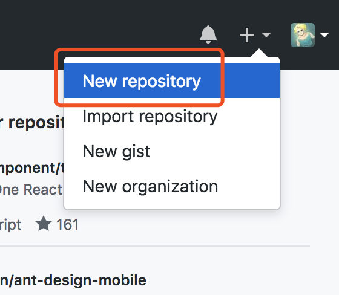

</details>
<details>
<summary>✨ 步骤2 ✨</summary>

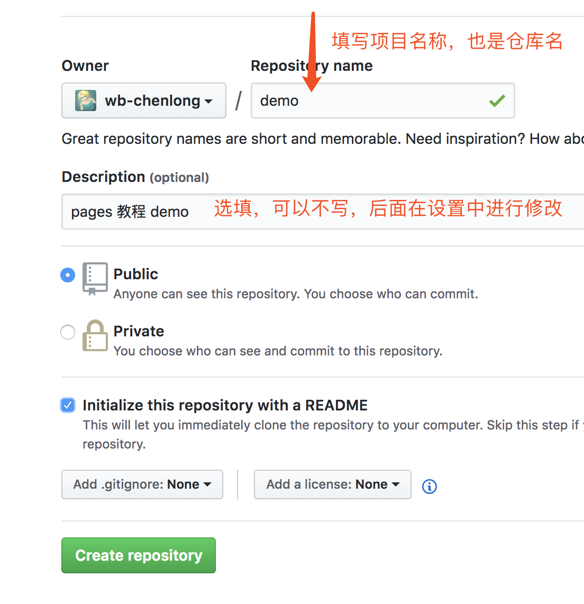

</details><br/>

> 在仓库下新建一个 index.html 页面，并开启 pages 进行查看

<details>
<summary>✨ 步骤1 ✨</summary>

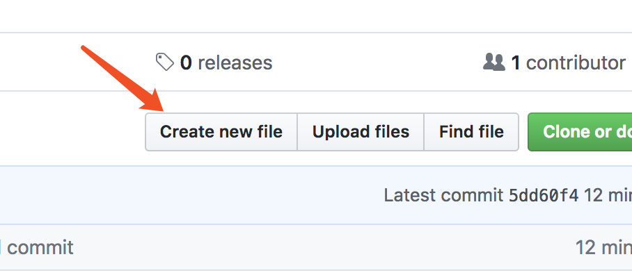

</details>
<details>
<summary>✨ 步骤2 ✨</summary>

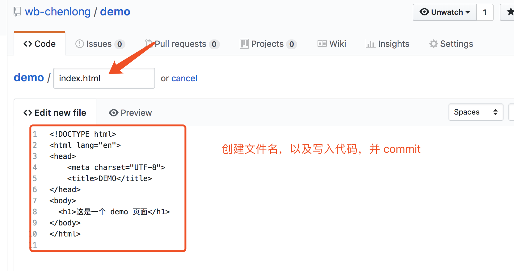

```
<!DOCTYPE html>
<html lang="en">
<head>
    <meta charset="UTF-8">
    <title>DEMO</title>
</head>
<body>
  <h1>这是一个 demo 页面</h1>
</body>
</html>
```

</details>
<details>
<summary>✨ 步骤3 ✨</summary>


</details>
<details>
<summary>✨ 步骤4 ✨</summary>

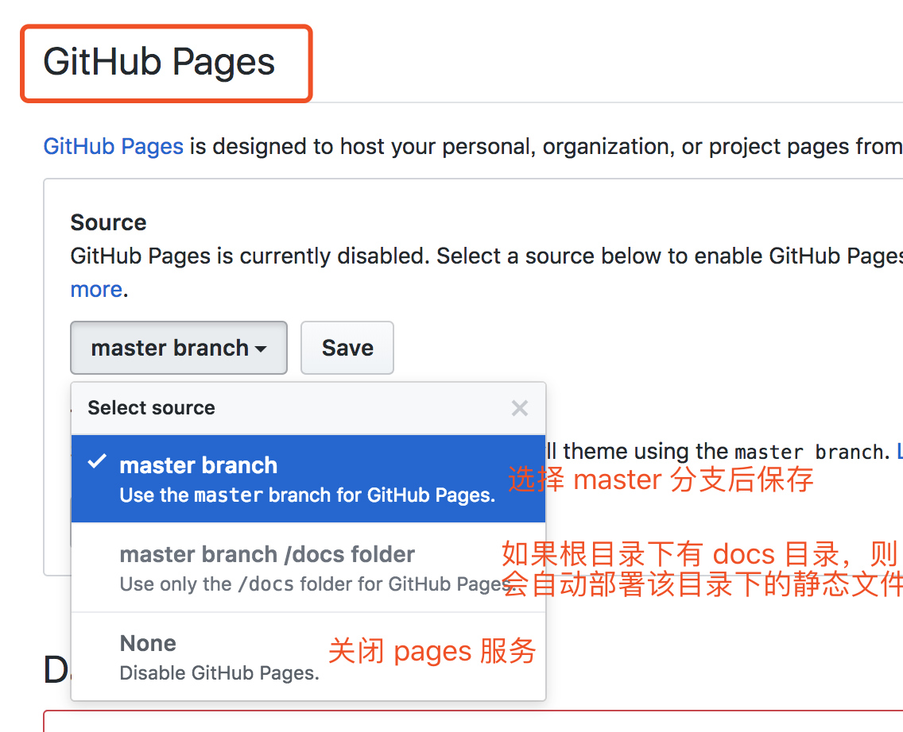

</details>
<details>
<summary>✨ 步骤5 ✨</summary>

> 查看 https://<用户id>.github.io/<项目名>/index.html<br/>
> 本例子中的地址为：https://wb-chenlong.github.io/demo/index.html

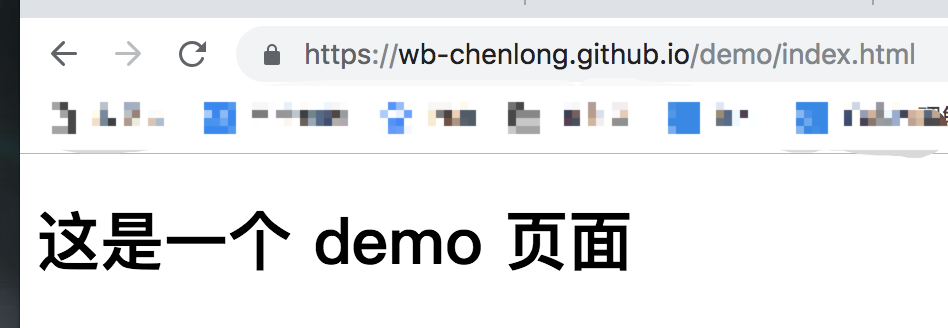

</details>

### 在仓库中创建你的单页应用

> 创建中的 app 中包含打包后的 dist 目录

<details>
<summary>✨ 步骤1 ✨</summary>

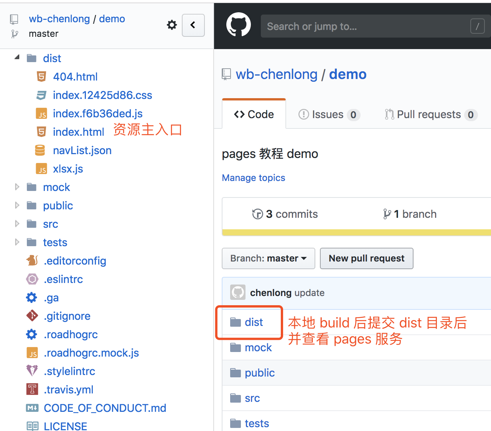

</details>
<details>
<summary>✨ 步骤2 ✨</summary>

- 本例子中的访问地址：https://wb-chenlong.github.io/demo/dist/index.html
	- `<demo>`：项目名
	- `<dist>`：项目下的 dist 目录
	- `<index.html>`：dist 目录下的主入口文件

</details>
<details>
<summary>✨ 步骤3 ✨</summary>


> 当我们访问已经加载好的页面路由时，是可以正常正常访问的，如上图。但是当我们刷新该路由页面时，发现 404 了。这是因为在该 dist 目录下，不存在 /demo/dist/qrcode 资源。这个文档，我们在后面进行解决。

</details>

### 使用 Travis CI 进行自动化构建

> 上面的教程中，我们发现，每次我们修改代码后，都需要进行打包，并将打包后的文件一并提交。这让我们多了很多的工作量。那有没有什么工具可以帮我们解决构建问题呢，请往下看。

<details>
<summary>✨ 步骤1 ✨</summary>

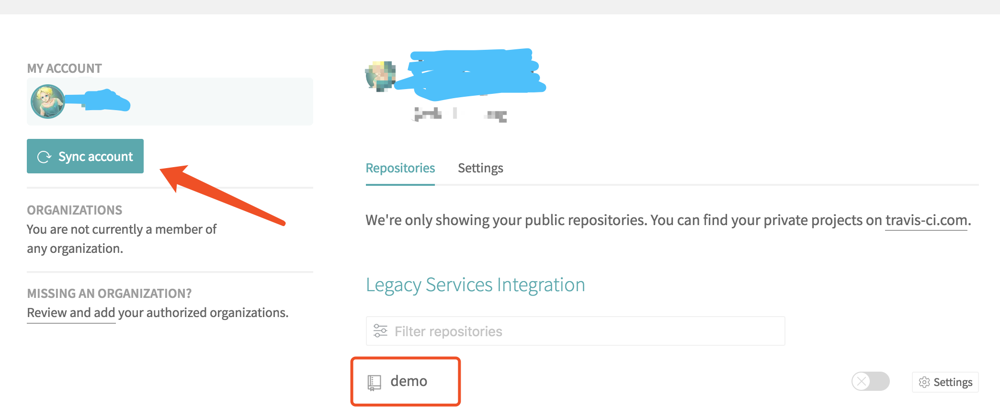

- 使用 github 账号登录 Travis CI 平台
- 同步 github 账号的仓库

</details>
<details>
<summary>✨ 步骤2 ✨</summary>

- 为 github 仓库的根目录下添加构建脚本 `.travis.yml`

```
language: node_js # 使用 nodejs 作为构建语言

node_js:
  - "8" ## 版本为 8 以上

install:
  - npm install # 安装依赖

script:
  - npm run build # 依赖安装完成后，进行打包构建

# 分支白名单
branches:
  only:
    - master # 只对 master 分支进行构建

# GitHub Pages 部署
deploy:
  provider: pages
  skip_cleanup: true
  # 令牌秘钥，在主页面用户的 Setting 中创建
  github_token: $GITHUB_TOKEN
  # 将 dist 目录下的内容推送到默认的 gh-pages 分支上
  local_dir: dist
  target_branch: gh-pages
  on:
    branch: master
```

</details>
<details>
<summary>✨ 步骤3 ✨</summary>

- 添加构建秘钥：github 页面右上角头像下拉框 Settings --> 左侧菜单 Developer settings --> Personal access tokens --> Generate new token
- 秘钥中的 Select scopes 信息，除了 delete_repo 不必勾选，其他我都勾选了
- 创建成功后，会有一串 token，这个就是授权 Travis 平台帮我们构建用的。

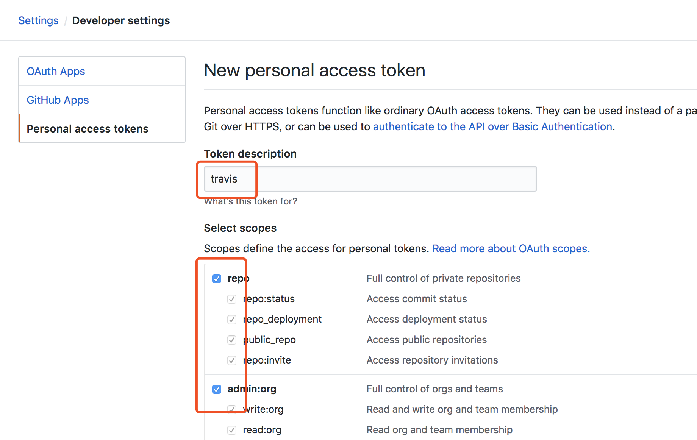

</details>
<details>
<summary>✨ 步骤4 ✨</summary>

- 脚本中的 `GITHUB_TOKEN` 变量需要在 travis 上进行设置

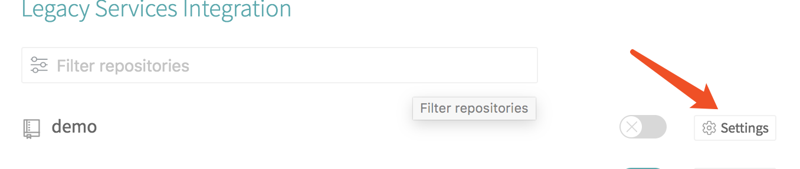
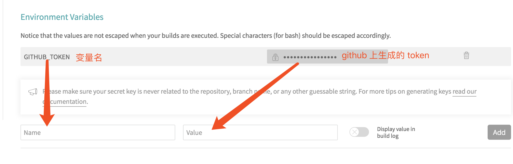

</details>
<details>
<summary>✨ 步骤5 ✨</summary>

- 删除 github 项目下的 dist 目录，并进行提交。提交后，travis 平台会自动捕获到提交信息，并进行构建。
- 如下图信息，已经构建完成。
- 查看 github 项目，会发现多了一个 gh-pages 分支，且打包后的文件都在该目录下。
- 将 pages 从 master 分支改成 gh-pages 分支，并等候一会后再进行访问。
- 访问地址：https://wb-chenlong.github.io/demo/index.html

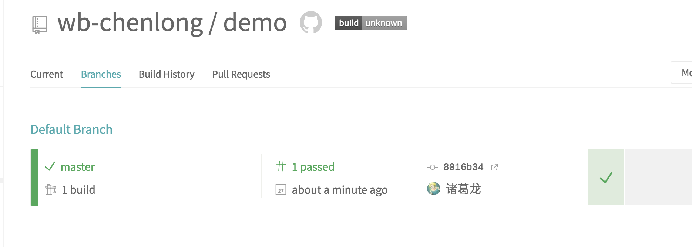

</details>

### .travis.yml 脚本命令执行顺序

```

```

### 解决 404 问题

> 根据上面的步骤，我们完成了自动化构建。但是我们会发现，404 的问题还是存在。不必担心，在上面的自动化构建后，我们多了一个 gh-pages 分支，而且庆幸的是，github 允许我们在 gh-pages 分支下自定义 404 页面。

- 在 gh-pages 分支上创建 404.html 页面

	> URL='/demo' ，demo 为项目名

	```
	<!DOCTYPE html>
	<html lang="en">
	<head>
   <meta charset="UTF-8">
   <title>FAVORITES</title>
   <script>
   		sessionStorage.redirect = location.href;
  	</script>
  	<meta http-equiv="refresh" content="0;URL='/demo'"></meta>
	</head>
	<body></body>
	</html>
	```
- 项目文件中的 index.html 中添加脚本

	```
	<script>
    (function(){
      var redirect = sessionStorage.redirect;
      delete sessionStorage.redirect;
      if (redirect && redirect != location.href) {
        history.replaceState(null, null, redirect);
      }
    })();
  	</script>
	```

### 感谢

> 由于 github 免费后，给我们提供了非常多的功能。在尝试使用 pages 服务时，也踩了很多的坑。比如，如何解决 404 问题，如何自动化部署等。

[感谢这篇文章的作者](https://github.com/neal1991/articles-translator/blob/master/Github%20Pages%E4%BB%A5%E5%8F%8A%E5%8D%95%E9%A1%B5%E9%9D%A2%E5%BA%94%E7%94%A8.md)


