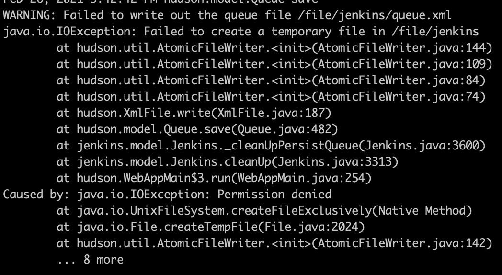

## jenkins

### 相关命令

```
// 启动
service jenkins start
systemctl start jenkins

// 重启
service jenkins restart

// 停止
service jenkins stop
systemctl stop jenkins

// url-关闭
http://localhost:8080/exit

// url-重启
http://localhost:8080/restart

// url-重新加载配置文件
http://localhost:8080/reload
```

### 配置文件

```
// war包地址
$ cd /usr/lib/jenkins

// 配置文件
$ vim /etc/sysconfig/jenkins

// 默认的主目录
$ cd /var/lib/jenkins

// 日志文件目录
$ cat /var/log/jenkins/jenkins.log
```

### linux 下的 workspace 目录更改

> 应用使用一段时间后，发现系统盘空间不够了，导致所有服务都挂了，于是想将 workspace 目录迁移至新购的数据盘中

#### step1：关闭服务

```
$ systemctl stop jenkins
```

#### step2：删除 workspace 目录内容

> 由于目录文件会比较大，copy 的时候会非常慢，如果不建议，可跳过此阶段。清除完之后，整个目录大小在几个G左右。

```
// workspace 目录下的文件删除后不会对应用有影响
$ rm -rf /var/lib/jenkins/workspace/*
```

#### step3：迁移目录

> 假设新磁盘目录是 /db2

```
$ cp -r /var/lib/jenkins /db2
```

#### step4：修改文件夹权限

> 新复制的 /db2/jenkins 如果没有修改读写权限，在 jenkins 启动时会报错。如果报错了，查看下日志输出。



```
$ chmod -R 777 /db2/jenkins
```

#### step5：修改配置文件

```
$ vim /etc/sysconfig/jenkins

// 修改 JENKINS_HOME
JENKINS_HOME="/db2/jenkins"

// 保存退出
```

#### step6：重新启动 jenkins

```
$ systemctl start jenkins
```
