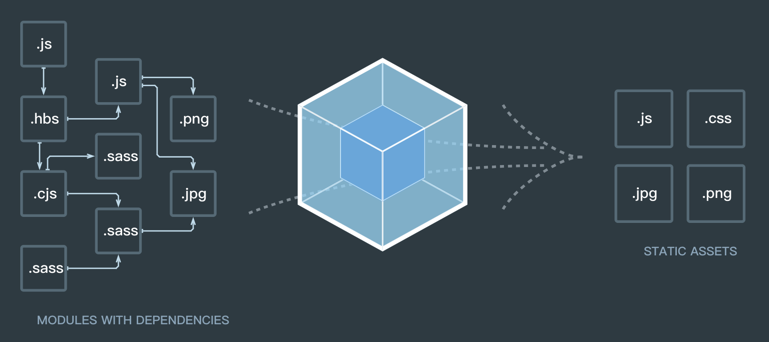
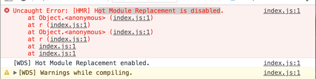
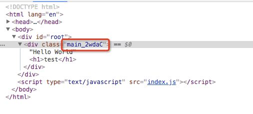
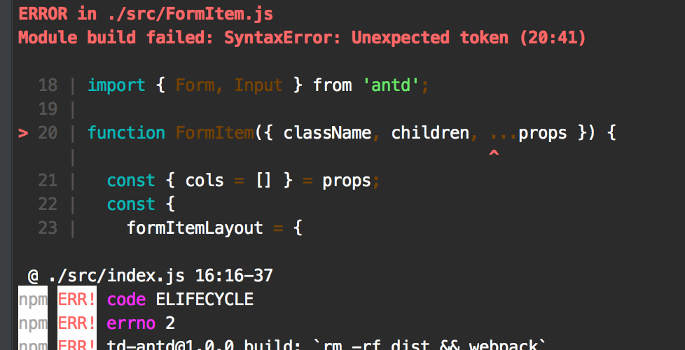

## webpack 入门，简单搭建一个脚手架

- 官方文档
	- [英文很牛逼-->](https://webpack.js.org/concepts/)
	- [还是中文吧-->](https://www.webpackjs.com/concepts/)

- 版本：v4 +
	- 注意，在 v4 版本中，webpack 和 webpack-cli 需要同时使用

- demo内容：`webpack + server + react + less + mockJS`
- 环境：mac + node
	- node: 8+
	- 如果你是非 mac 也无关紧要，只是有些命令不同而已，比如全局安装不需要 sudo 之类的。

- 适合人群：初学者，或者想要了解 webpack 的同学

### 写在前头

> 如果你对 webpack 的配置还不太了解，建议先查看下官网文档（上面有传送门），如果不想查看也没关系，之后我们会通过一个 demo 的搭建来帮助你认识各个 API 的作用。让我们开始吧，gogogo！！！

### 什么是 webpack

> 其实就是将各个模块，脚本，资源等进行打包，输出打包后的文件。webpack 就像是一个打包机。我们可以看下官网的图片，就会一目了然。



----

#### 开始前准备

- cnpm 安装
	- 为什么要使用 cnpm 呢？这个是淘宝的镜像源，npm 安装包有时候会特别慢，但是 cnpm 是国内的，会比较快。cnpm 会将 npm 上的资源缓存到国内的服务器上。so。。。

```
sudo npm install -g cnpm --registry=https://registry.npm.taobao.org
```

#### 初始化

```
$ mkdir demo
$ cd demo
$ npm init

// 会出现各种配置项确认，都回车确认即可
```

#### 安装 webpack && webpack-cli

```
$ cnpm install --save-dev webpack@4.8.3 webpack-cli@2.1.3
```

#### 创建配置文件

- webpack 配置文件，程序在执行时会读取该配置文件，并按照配置进行打包输出
- 在根目录下创建

webpack.config.js

```
const path = require('path');
module.exports = {
	// 指定的入口文件
	// v4 版本中默认路径为 “./src”
	entry: './src/index.js',
	// 输出 bundles
	output: {
		// bundle 的名称
		filename: 'index.js',
		// bundle 生成到 dist 目录下
		// __dirname 在 node 中指代当前根目录
		path: path.resolve(__dirname, 'dist')
	},
};
```

#### 创建 index.js 文件

src/index.js

```
var main = document.createElement('div');
main.textContent = "HELLO WORLD!!!";

document.querySelector("#root").appendChild(main);
```

#### 创建 index.html

dist/index.html

```
<!DOCTYPE html>
<html lang="en">
<head>
    <meta charset="UTF-8">
    <title>webpack demo</title>
</head>
<body>
	<div id="root"></div>
</body>
<script src="index.js"></script>
</html>
```

#### 打包

此时的目录结构为

```
- demo
  - dist
    - index.html
  - src
    - index.js
  - package.json
  - webpack.config.js 
```

```
$ webpack
// 输出 dist/index.js
```
> 打开 dist/index.html，页面上有正确的打印

----

### 插件 plugins

> 插件是 wepback 的支柱功能，解决 loader 无法实现的其他事情。

### HtmlWebpackPlugin

[API](https://www.npmjs.com/package/html-webpack-plugin)

> 提供一个 html 模板文件，并通过配置可在指定文件输出 html

插件安装

```
$ cnpm install --save-dev html-webpack-plugin@3.2.0
```

webpack.config.js

```
+ const HtmlWebpackPlugin = require('html-webpack-plugin');

module.exports = {
  ...,
  plugins: [
    new HtmlWebpackPlugin({
      template: './src/index.html', // 模板存放路径
      title: 'hahaha' // html 模板中的 title
    })
  ]
};
```

#### 修改 index.html

```
// src/index.html

<!DOCTYPE html>
<html lang="en">
<head>
    <meta charset="utf-8">
    <title><%=htmlWebpackPlugin.options.title%></title>
</head>
<body>
<div id='root'>
</div>
</body>
</html>
```

#### 打包

```
// 删除 dist 文件后运行命令
$ webpack

// 输出
- dist
  - index.html
  - index.js
```

### clean-webpack-plugin

- [API](https://www.npmjs.com/package/clean-webpack-plugin)
- 功能：在打包前“清理/删除”指定的目录
- 场景：在变更 output --> filename 时，打包后不会覆盖原来的文件，如

	```
	// 原来 filename: index.js，打包后
	- dist
	 - index.js
	
	// 变更 filename: main.js，打包后
	- dist
	 - index.js
	 - main.js
	```
	> 可以看到 main.js 并不会覆盖原来的 index.js。而 CleanWebpackPlugin 插件会在打包前先进行清理，这样的话就不会有多余的文件出现。
	
插件安装

```
$ cnpm install --save-dev clean-webpack-plugin@0.1.19
``` 

webpack.config.js

```
+ const CleanWebpackPlugin = require('clean-webpack-plugin');

module.exports = {
  ...,
  plugins: [
    ...,
    new CleanWebpackPlugin('./dist')
  ]
};
```
- 骚操作：可以不需要额外插件

	```
	// package.json
	{
		...
		"scripts": {
			 "build": "rm -rf dist && webpack",
		},
		...
	}
	```

### webpack-dev-server

- [API](https://www.webpackjs.com/configuration/dev-server/)
- 提供一个实时刷新的开发服务器，只能用于开发环境。
- 场景：在本地修改代码后，会实时刷新浏览器并加载更新后的代码。

插件安装

```
$ cnpm install --save-dev webpack-dev-server@3.1.4
```

webpack.config.js

```
module.exports = {
	...
	devServer: {
    contentBase: './dist', // 页面根目录，如果不行，请使用 path.resolve(__dirname, 'dist')
    host: 'localhost', // 默认，如果指定 host 地址，在同网局域网下可以自由访问
    port: '8080', // 端口号，默认8080
    open: true, // 自动打开浏览器
    inline: true, // 默认为true, 在打包时会注入一段代码到最后的js文件中，用来监视页面的改动而自动刷新页面
    historyApiFallback: true, // 当我们搭建 spa 应用时非常有用，它使用的是 HTML5 History Api，任意的跳转或404响应可以指向 index.html 页面
    hot: true, // 热加载
    progress: true, // 显示打包进度
    quiet: true, // 控制台是否打印信息，true = 不打印
    before(app) {},	// 打包前回调
    after(app) {},	// 打包后回调
  },
}
```

package.json

```
{
	...
	"scripts": {
		"start": "webpack-dev-server",
		"build": "webpack"
	},
	...
}
```

cnpm start

> 启动后会自动打开浏览器，此时会发现，页面上是空白的，打开控制台，发现有错误信息，大致意思是热加载被禁用。那我们把 hot 设置成 false 试下



webpack.config.js

```
module.exports = {
	...
	devServer: {
		...
		hot: false,
		...
	},
	...
}

// 然后我们再执行 cnpm start，发现页面正常了。使用 cnpm run build，打包也是正常的。
```

> 如果我们要使用 HMR 的 hot 该怎么办呢？webpack 内置了热加载的插件，我们加上去就可以了。

webpack.config.js

```
const webpack = require('webpack');
module.exports = {
	...
	devServer: {
		...
		hot: true,
		...
	},
	plugins: [
		...
		new webpack.HotModuleReplacementPlugin(), // 热加载插件
	],
	...
}

// 再运行 cnpm start 发行就不会报错了。页面也正常了。
```

----

### modules 模块

> 在 node 中，一切皆为模块，如 json、js、css等，引用这些模块，我们需要一些依赖

### json 文件引用

> webpack v2+ 开始已经内置支持了 json 文件，所以无需额外配置依赖

src/demo.json

```
{
	"text": "Hello World"
}
```

src/Main.js

```
const demoJson = require('./demo.json');

module.exports = function() {
  var main = document.createElement('div');
  main.textContent = demoJson.text;
  return main;
};

// 执行 cnpm start 查看
```

### Babel

- 会将 javascript 进行编译，以适应各个浏览器。
	- 将 ES6，ES7，React 等编译成浏览器能识别的代码。

安装依赖

```
// 依赖大致有这些，可以手动添加到 package.json 中，再 cnpm i
"babel-core": "^6.26.3",
"babel-loader": "^7.1.4",
"babel-plugin-react-transform": "^3.0.0",
"babel-preset-env": "^1.7.0",
"babel-preset-react": "^6.24.1",

// 一次性安装
cnpm install --save-dev babel-core babel-loader babel-plugin-react-transform babel-preset-env babel-preset-react
```

webpack.config.js

```
module.exports = {
	...
	module: {
		rules: [
			{
            test: /(\.jsx|\.js)$/,
            use: {
                loader: "babel-loader",
                options: {
                    presets: [
                        "env", "react"
                    ]
                }
            },
            exclude: /node_modules/
          }
		],
	},
	...
}
```

> 注：基本用法，如 test、use、exclude 等的含义，请参考官网

安装 react 包

```
cnpm install --save react react-dom
```

src/Main.js

```
import React, {Component} from 'react';
import demo from './demo.json';

class Main extends Component{
  render() {
    return (
      <div>
        {demo.text}
        <h1>test</h1>
      </div>
    );
  }
}

export default Main;
```

src/index.js

```
import React from 'react';
import { render } from 'react-dom';
import Main from './Main';

render(<Main />, document.getElementById('root'));
```

> cnpm start 启动后可以看到正常的页面了。
> 
> 我们也可以将 babel 的 options 配置放到 .babelrc 文件中，webpack 在打包时会读取该配置文件，如下：

根目录下创建 .babelrc [更多使用方法](https://babeljs.cn/docs/usage/babelrc/)

```
{
  "presets": ["react", "env"]
}
```

### CSS

- 在代码中，css 也是非常重要的模块，webpack 提供了一些工具来处理样式表。

安装依赖

```
cnpm install --save-dev style-loader@0.21.0 css-loader@0.28.11
```

webpack.config.js

```
module.exports = {
	...
	module: {
		rules: [
			...
			{
        		test: /\.css$/,
        		use: [{loader: "style-loader"}, {loader: "css-loader"}]
      		}
		]
	},
	...
}
```

新建 css --> src/index.css

```
h1 {
    color: red;
}
```

src/index.js 中引入 index.css

```
+ import './index.css';
```

> cnpm start 后，查看样式是否生效

### CSS module

- 表示当前样式类只会在某个模块中生效，从而使样式具有唯一性，而不会使各个模块的样式有冲突，这样做有效避免了全局污染。

修改 webpack.config.js

```
module.exports = {
	...
	module: {
		rules: [
			...
			{
        		test: /\.css$/,
        		use: [{
        			loader: "style-loader"
        		}, {
        			loader: "css-loader",
        			options: {
        				modules: true, // 启用模块
        				localIdentName: "[local]_[hash:base64:5]"
        			}
        		}]
      		}
		]
	},
	...
}
```

src/Main.css

```
.main {
    color: blue;
}
```

src/Main.js

```
import React, {Component} from 'react';
import demo from './demo.json';
import styles from './Main.css';

class Main extends Component{
  render() {
    return (
      <div className={styles.main}>
      {demo.text}
        <h1>test</h1>
      </div>
    );
  }
}

export default Main;
```

cnpm start 进行查看，可以看到类名后生成了随机码，如下图：



### less

- [API](https://www.npmjs.com/package/less-loader)
- 是一种 css 预处理器，webpack 会将依据 less-loader 将其转化为普通的 css

安装依赖

```
cnpm install --save-dev less@3.0.4 less-loader@4.1.0
```

新建 src/Main2.less

```
.main {
  color: pink;
}
```

webpack.config.js

```
module.exports = {
	...
	module: {
		rules: [
			...
			{
        		test: /\.css|\.less$/,
        		use: [
        			"style-loader", 
        			{
        			  loader: "css-loader",
        			  options: {
        				  modules: true, // 启用模块
        				  localIdentName: "[local]_[hash:base64:5]"
        			},
        			"less-loader",
        		}]
      		}
		]
	},
	...
}
```

src/Main.js

```
import React, {Component} from 'react';
import demo from './demo.json';
import styles from './Main.css';
import styles2 from './Main2.less';

class Main extends Component{
  render() {
    return (
      <div className={styles.main}>
        <div className={styles2.main}>main2</div>
      {demo.text}
        <h1>test</h1>
      </div>
    );
  }
}

export default Main;
```

> cnpm start 后，能在页面上看到，css 和 less 都起效果了。

### mini-css-extract-plugin

- [API](http://npm.taobao.org/package/mini-css-extract-plugin)
- 按照我们上面的配置进行 build 后，发现 css 并没有打包出来，而是打包到 index.html 的 style 标签中了。这个插件的作用就是将我们的 css 单独进行打包。
- webpack v4 前版本，请使用 `extract-text-webpack-plugin` 插件，v4 版本后将无法使用。

安装依赖

```
cnpm install --save-dev mini-css-extract-plugin@0.4.0
```

webpack.config.js

```
+ const MiniCssExtractPlugin = require('mini-css-extract-plugin');

module.exports = {
	...
	module: {
		rules: [
			...
			{
        		test: /\.css|\.less$/,
        		use: [
        			MiniCssExtractPlugin.loader,
        			{
        			  loader: "css-loader",
        			  options: {
        				  modules: true, // 启用模块
        				  localIdentName: "[local]_[hash:base64:5]"
        			},
        			"less-loader",
        		}]
      		}
		]
	},
	...
	plugins: [
		...
		new MiniCssExtractPlugin({
      		filename: 'index.css',
      		chunkFilename: 'index.css'
    	}),
	]
}
```

> 现在我们再 build 后就会有独立的 css 文件了。

### uglifyjs-webpack-plugin

1. 压缩打包工具
2. v4 版本前 webpack 内置了 webpack.optimize.UglifyJsPlugin()，v4 版本后无法再使用，需要使用独立的插件

安装依赖

```
cnpm install --save-dev uglifyjs-webpack-plugin
```

webpack.config.js

```
+ const UglifyJsPlugin = require('uglifyjs-webpack-plugin');

module.exports = {
	...
	plugins: [
		...
		new UglifyJsPlugin(),
	]
}
```

### webpack-api-mocker

- [API](https://www.npmjs.com/package/webpack-api-mocker)
- 该插件是 webpack-dev-server 的中间件，在没有实际后端接口的情况下，可以帮助我们进行模拟接口联调

安装依赖

```
cnpm install --save-dev webpack-api-mocker@1.5.15
```

添加 proxy.config.js 配置文件

```
module.exports = {
  'GET /api/test': (req, res) => {
    res.send({ name: '这是一个 mock 接口' });
  },
};

```

webpack.config.js

```
+ const apiMocker = require('webpack-api-mocker');

module.exports = {
	...
	devServer: {
		...
		before(app) {
      		apiMocker(app, path.resolve('./proxy.config.js'))
    	}
	},
	...
}
```

添加 src/fetch.js

```
import React, {Component} from 'react';

class Fetch extends Component{
  constructor(props) {
    super(props);

    this.state = {
      name: '',
    };
  }

  componentWillMount() {
    const that = this;
    fetch('/api/test')
      .then(response => response.json())
      .then(data => {
        that.setState({ name: data.name });
      })
  }

  render() {
    const { name} = this.state;

    return (
      <div>{name}</div>
    );
  }
}

export default Fetch;
```

src/Main.js

```
import React, {Component} from 'react';
import demo from './demo.json';
import styles from './Main.css';
import styles2 from './Main2.less';
+ import Fetch from './fetch';

class Main extends Component{
  render() {
    return (
      <div className={styles.main}>
        <div className={styles2.main}>main2</div>
      {demo.text}
        <h1>test</h1>
        <Fetch />
      </div>
    );
  }
}

export default Main;
```

----

## 优化

### externals

- [API](https://webpack.docschina.org/configuration/externals/)
- 如果我们想引用一个库(如：React)，但又不想让 webpack 将库代码进行打包，那么就可以用这个属性来定义哪些是不需要打包的，依赖“引用库”暴露出来的全局变量名。如果定义中的名称和库暴露的全局名称不同，则无效。这样的话，我们在生成环境中，就可以将“引用库”使用 CDN 的方式进行加载，减少了打包量的同时，还能利用 CDN 缓存机制，使页面加载更快速。

webpack.config.js

```
module.exports = {
	...
	externals: {
		"react": "React",
		"react-dom": "ReactDOM",
	}
}
```

> 打包后，dist/index.js 中将不会有 react 库的代码了。

### 给输出的 js 生成一个哈希值以减少缓存带来的麻烦

webpack.config.js

```
module.exports = {
	...
	output: {
    filename: 'index_[hash].js',
    path: path.resolve(__dirname, 'dist')
  },
	...
}
```

### babel-plugin-module-resolver

- [API](https://cnpmjs.org/package/babel-plugin-module-resolver)
- Babel模块解析插件, 在.babelrc中可以配置模块的导入搜索路径. 为模块添加一个新的解析器。请看 demo。

安装依赖

```
cnpm install --save-dev babel-plugin-module-resolver@3.1.1
```

.babelrc

```
{
  "presets": ["react", "env"],
  "env": {
    "development": {
      "plugins": [
        ...,
        ["module-resolver", {
          "root": ["./src"],
          "alias": {
            "test": "./test",
            "underscore": "lodash"
          }
        }]
      ]
    }
  }
}
```

src/components/index.js，新建目录及文件

```
import React, {Component} from 'react';

class Components extends Component{
  render() {
    return (
      <div>
        Components
      </div>
    );
  }
}

export default Components;
```

src/routes/index.js，新建目录及文件

```
import React, {Component} from 'react';
import Components from 'components'; // 这里使用了重新定义的路径解析

class Routes extends Component{
  render() {
    return (
      <div>
        Routes
        <Components />
      </div>
    );
  }
}

export default Routes;
```

> 然后将 routes 的模块 import 到主页面中，start 后查看吧。

### devServer.proxy

- [API](https://webpack.js.org/configuration/dev-server/#devserver-proxy)
- [http-proxy-middleware](https://github.com/chimurai/http-proxy-middleware)
- webpack-dev-server 自带了 http-proxy-middleware 插件。
- 场景：有时候我们在本地开发的时候(start 开启的本地 localhost 服务器)，想代理线上或者开发服务器上的 api 接口，如果直接调用(如：http://xxxx.xx.json)会提示我们跨域而拿不到数据。devServer.proxy 为我们提供了重定向的功能，这样我们就可以在本地拿服务器上的接口来进行联调了。
- 注意：如果 webpack-api-mocker 设置的 mock 接口与你想代理的接口一致时，会优先读取本地的 mock 接口。所以开始栗子前，请先关闭 devServer.before。
- 模拟接口：复制脚手架，修改端口号为 3000，设置 mockJs 接口，如果你按照上面的文档进行编写的话，已经有一个 /api/test 的接口了。然后启动。浏览器里黏贴 http://localhost:3000/api/test。会得到 mock 数据。然后再来修改需要代理的脚手架。

webpack.config.js

```
module.exports = {
	...
	devServer: {
		...
		proxy: {
			// 需要代理的本地路径
			'/api/*': {
				// 需要代理的服务器
				target: 'http://localhost:3000'
			}
		}
	}
	...
}

// 整合以后的 url = http://localhost:3000/api/*
```

> 重新 cnpm start，查看控制台请求，会发现获取到了 localhost:3000 的接口数据。


### 多 mock 文件合并

> 当我们把所有的 mock 接口都写在一个文件中，日积月累后，这个文件会非常庞大，且不便于管理。所以我们需要把文件拆分开来，再读取时进行合并就好了。

- 插件：webpack-api-mocker
- version：1.5.15

创建 mock 目录；添加 mock/a.js；添加 mock/b.js

```
// a.js
module.exports = {
  'GET /api/test': (req, res) => {
    res.send({ name: '这是 a.js 的接口文件' });
  },
};

// b.js
module.exports = {
  'GET /api/test2': (req, res) => {
    res.send({ name: '这是 b.js 的接口文件' });
  },
};
```

删除 proxy.config.js<br/>
添加 webpack.mock.js

```
const fs = require('fs');
const path = require('path');
// delay 可以延时处理接口请求
const delay = require('webpack-api-mocker/utils/delay');

const mock = {};

fs.readdirSync(path.join('./mock')).forEach(function (file) {
  Object.assign(mock, require('./mock/' + file));
});

module.exports = delay(mock, 2000);
```

修改 webpack.config.js

```
module.exports = {
	...
	devServer: {
		...
		before(app) {
      		apiMocker(app, path.resolve('./webpack.mock.js'));
    	}
	},
	...
}
```

> npm start 后可能会出现下图问题。这是因为在新版本中，添加了监听事件。当 mock 文件被修改后，能够实时进行更新。在 start 时，外部的 webpack.mock.js 会读取 mock 目录下的文件进行合并，从而重复进行了覆盖操作。我们将 webpack.mock.js 移入到 mock 目录下即可解决该问题。


将 webpack.mock.js 移入到 mock 并修改

```
const fs = require('fs');
const path = require('path');
const delay = require('webpack-api-mocker/utils/delay');

const mock = {};

fs.readdirSync(path.join('./mock')).forEach(function (file) {
  Object.assign(mock, require('./' + file));
});

module.exports = delay(mock, 2000);
```
修改 webpack.config.js

```
...
  before(app) {
    apiMocker(app, path.resolve('./mock/webpack.mock.js'));
  }
...
```
> 再执行 npm start 就好啦！！！

### mock 和 proxy 切换

> 在开发静态页面时，只需要本地 mock 接口即可。到了联调时，我们想通过 proxy 的反向代理后端的接口进行联调。两种情况，我们可以使用变量和命令进行切换。

- npm start：使用本地的 mock 接口
- npm run proxy：反向代理后端接口

修改 package.json

```
// 添加 proxy 命令
"scripts": {
  ...
  "proxy": "PROXY=true webpack-dev-server",
  ...
}
```

修改 webpack.config.js

```
// 获取是否开启反向代理的变量
+ const isProxy = process.env.PROXY === 'true';

module.exports = {
  ...
    devServer: {
      ...
      before(app) {
        + if (!isProxy) {
          apiMocker(app, path.resolve('./mock/webpack.mock.js'));
        + }
      }
      ...
    }
  ...
}
```

### ESlint

> 代码规范检查工具，现在基本已经代替 JSlint。<br/>
> 可对 js、jsx、react、vue、AngularJs、es6、style 等进行规范检查。

- [官网](https://eslint.org/)

安装依赖

```
// 如果需要安装 vue 之类的检查，请安装对应的模块，这里以 react 为准。
cnpm install --save-dev eslint eslint-config-airbnb eslint-plugin-import eslint-plugin-jsx-a11y eslint-plugin-react
```

根目录下添加配置文件 .eslintrc

```
{
  "extends": "eslint-config-airbnb"
}
```

package.json 添加命令

```
"scripts": {
	"lint": "eslint --ext .js src mock"
}
```

运行命令检查 cnpm run lint


### stylelint

> 样式规范检查工具。<br/>
> 可对 html、css、sass、less 等进行规范检查

- [github](https://github.com/stylelint/stylelint)

安装依赖

```
cnpm install --save-dev stylelint stylelint-config-standard
```

根目录下添加配置文件 .stylelintrc

```
{
  "extends": "stylelint-config-standard"
}
```

package.json 添加命令

```
"scripts": {
	"stylelint": "stylelint \"**/*.less\""
}
```

运行命令 cnpm run stylelint


### 单元测试 jest

> Jest 是由 Facebook 发布的开源的、基于 Jasmine 的 JavaScript 单元测试框架。React 的单元测试也都是由 Jest 完成的。

- [官网](https://jestjs.io/docs/en/getting-started)

安装依赖

```
cnpm install --save-dev jest
```

创建需要测试的文件，src/sum.js

```
function sum(a, b) {
  return a + b;
}

module.exports = sum;
```

创建测试文件，test/sum.test.js

```
const sum = require('../src/sum');

test('test 1 plus 2 result', () => {
  expect(sum(1, 2)).toBe(3);
});

test('test 2 plus 2 should equal 4', () => {
  expect(sum(2, 2)).toBe(4);
});
```

package.json 中添加命令

```
"scripts": {
	"test": "jest test/*.test.js"
}
```

运行命令 cnpm run test


#### 可能的报错，以及解决方案

<span style="color: red">error: </span>Plugin/Preset files are not allowed to export objects, only functions. 

```
// 升级 babel 到 7+
"@babel/cli": "^7.4.4",
"@babel/core": "^7.2.2",
"@babel/plugin-proposal-object-rest-spread": "^7.4.4",
"@babel/preset-env": "^7.3.1",
"@babel/preset-react": "^7.0.0",

// 修改 .babelrc
{
  "presets": ["@babel/react", "@babel/env"],
  "plugins": ["@babel/plugin-proposal-object-rest-spread"]
}
```

### TypeScript

安装依赖

```
cnpm install --save-dev typescript ts-loader
```

添加 tsconfig.json

```
{
  "compilerOptions": {
    "module": "commonjs",
    "target": "es5",
    "sourceMap": true
  },
  "exclude": [
    "node_modules"
  ]
}
```

修改 webpack.config.js

```
{
	enter: './src/index.ts',
	module: {
		rules: [
			...
			{
				test: /\.ts$/,
        		use: 'ts-loader',
			}
		],
	},
}
```

src 目录下创建 index.ts

```
console.log('hello TypeScript');
```

> cnpm start 后查看控制台输出

### ES6 的 rest(...) 语法支持

- [npm](https://www.npmjs.com/package/babel-plugin-transform-object-rest-spread)

```
// 支持解析此类用法
let n = { x, y, ...z };
```

错误码



依赖安装

```
npm i -D babel-plugin-transform-object-rest-spread
```

.babelrc

```
{
  ...,
  "plugins": ["transform-object-rest-spread"]
}
```

### webpack-node-externals

> 在使用 npm 开发组件时，常会使用该插件进行忽略 node_modules 下的所有包文件，这样打包出来的文件就是纯组件文件。

- [npm](https://www.npmjs.com/package/webpack-node-externals)

依赖安装

```
npm install -D webpack-node-externals
```

webpack.config.js

```
var nodeExternals = require('webpack-node-externals');
...
module.exports = {
    ...
    target: 'node',
    externals: [nodeExternals()],
    ...
};
```

### webpack-bundle-analyzer

> 代码的打包依赖分析<br/>
> 默认端口号：8888

- [npm](https://www.npmjs.com/package/webpack-bundle-analyzer)

依赖安装

```
npm install -D webpack-bundle-analyzer
```

webpack.config.js

```
const BundleAnalyzerPlugin = require('webpack-bundle-analyzer').BundleAnalyzerPlugin;
 
module.exports = {
  plugins: [
    new BundleAnalyzerPlugin()
  ]
}
```

将 analyzer 和 build 命令分开

```
// package.json
{
	"scripts": {
		"analyze": "ANALYZE=true webpack"
	}
}

// webpack.config.js

const isAnalyze = process.env.ANALYZE === 'true'; // 获取到分析变量
const plugins = [
  new webpack.HotModuleReplacementPlugin(),
  new HtmlWebpackPlugin({
    template: path.resolve(__dirname, './src/index.html'),
    title: 'webpack-react',
  }),
  new MiniCssExtractPlugin({
    filename: 'index.css',
    chunkFilename: 'index.css',
  }),
  new CleanWebpackPlugin('./dist'),
];

// 当是分析时，则 plugins 数组中加入分析插件
isAnalyze && plugins.push(new BundleAnalyzerPlugin());

// config
{
  plugins: plugins
}
```