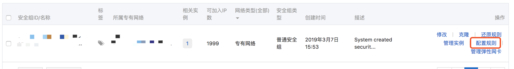
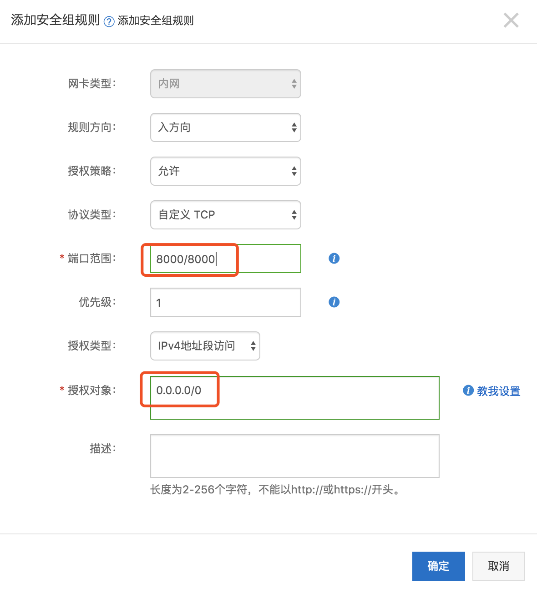
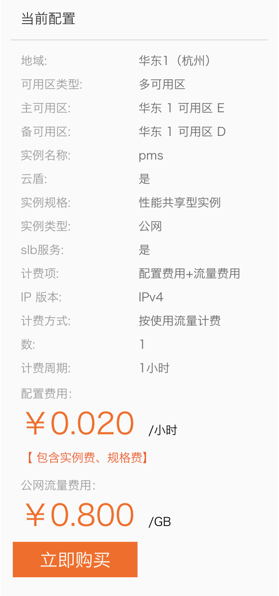
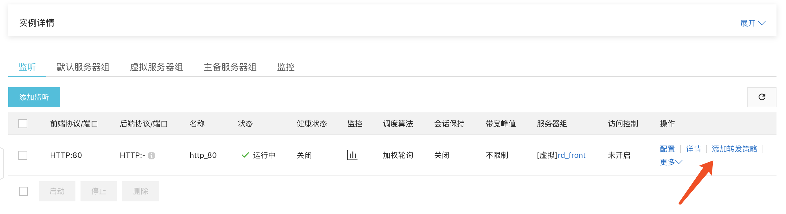
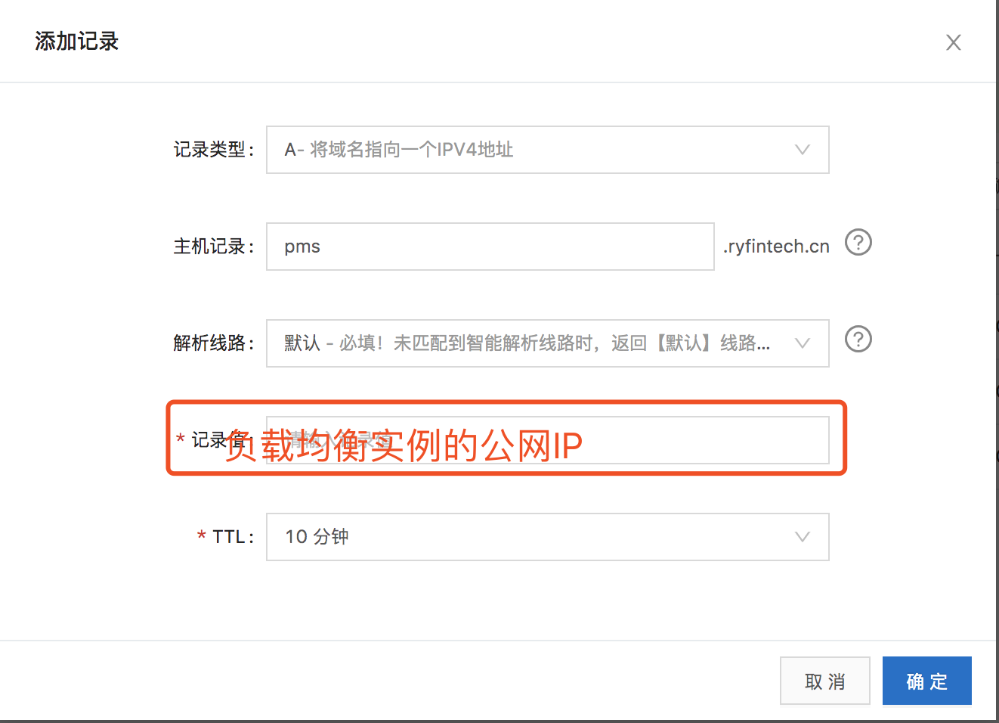

## 手动部署服务

> 内容包含服务器、域名、nginx、负载均衡、前端应用、后端应用等。<br/>
> 前后端分离

### 服务器

#### 前端

1. ssh链接服务器后，查询端口使用情况
	- netstat -lanput
2. 假设可使用的端口号
	- 前端：8000
	- 后端：8082/8083
3. 登录阿里云设置安全组来解放相应的端口号
	- 云服务器 --> 网络与安全 --> 安全组 --> 配置规则 --> 添加安全组规则
	- 在这里我们添加 「8000/8000」 和 「8082/8083」 的连个安全组
	
	
4. 上传前端应用，clone git 仓库上的代码。
	- /usr/share/nginx/html/pms
		- 假设在 html 位置 clone 了 pms 项目。
5. 配置 nginx 代理
	- /etc/nginx/conf.d 下创建 pms.conf，并添加如下配置：
	
	```
	server {
        ## 项目管理系统的线上环境配置
        listen       8000 default_server;
        # listen       [::]:80 default_server;
        server_name _;
        root         /usr/share/nginx/html/pms/dist;
        client_max_body_size 100m;

        # Load configuration files for the default server block.
        include /etc/nginx/default.d/*.conf;

        location / {
                try_files $uri $uri/ @router;
        }
        location @router {
                rewrite ^.*$ /index.html last;
        }
    }
	```
6. 重启 nginx
	- $ nginx -s reload
7. 本机测试
	- $ curl http://localhost:8000

#### 后端

1. 上传后端应用，clone git 仓库上的代码。
	- /usr/local/pms
		- 假设在以上位置 clone 了 pms 的后端项目。
2. 打包
	- cd 进入 pms 目录后运行如下命令：
	
	```
	// 确保服务器上有 mvn 服务
	$ mvn clean install -Dmaven.test.skip=true
	```
3. jar包部署

	```
	// 打包成功，进入 /app/web/target/
	// active=prod 指定的是 pms-prod.yml，在 http://github.abssqr.cn/abs/config/tree/master 中进行配置
	$ nohup java -jar web-0.0.1-SNAPSHOT-exec.jar --spring.profiles.active=prod  > log.file  2>&1 &
	```
4. 本机测试
	- $ curl http://localhost:8082/pms/login.json

### 负载均衡配置

1. 创建负载均衡，配置如下

	
	
2. 创建 “虚拟服务器组”：创建两个组，front(前端)、end(后端)
	- 输入服务器组名称
	- 添加服务器：我们 nginx 服务的机器
	- 配置端口号
		- front：80
		- end：8082
3. 配置
	- 路径：实例详情 --> 监听 --> 列表中的配置
	- 协议&监听：监听端口80
	- 后端服务器：选择服务器组(front)
	- 健康检查：关闭
	- 提交
4. 添加转发策略
	
	
	
	
### 域名配置



