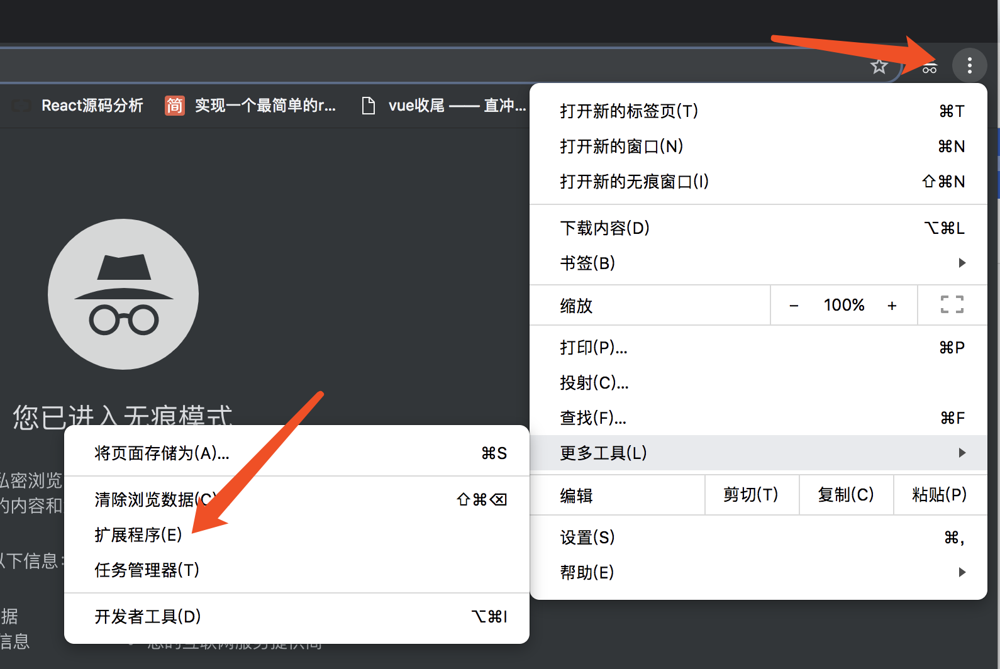
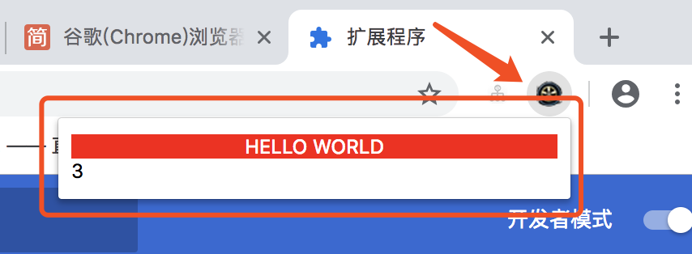
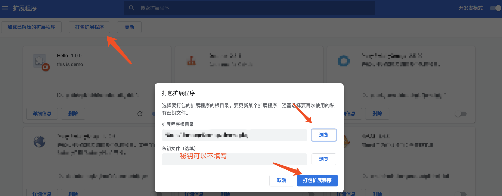

## 基础

> 基本配置项 + html + css + js

### 创建配置项

1. 新建目录文件夹 "hello"
2. 文件夹下创建 "manifest.json"
	
	```
	{
  		"name": "Hello", // 项目名称
  		"version": "1.0.0", // 版本号
  		"manifest_version": 2, // 文件自身的版本号，1 的版本已经弃用
  		"description": "this is demo", // 项目简介
  		"browser_action": {
    		"default_icon": "icon.png" , // 扩展包的显示图标
    		"default_popup": "hello.html" // 扩展包显示的内容
  		}
	}
	```
	
3. 创建 icon.png
> 可以是 19*19 以上的图标，最好是正方形的，请自行网络下载。

4. 创建 hello.html
> 可以外部加载 js 和 css
	
	```
	<!DOCTYPE html>
	<html lang="en">
	<head>
	  <meta charset="UTF-8">
	  <title>hello</title>
	  <style>
	    #container {
	      width: 300px;
	      background: red;
	      color: #fff;
	      text-align: center;
	    }
	  </style>
	</head>
	<body>
	  <div id="container">HELLO WORLD</div>
	  <div id="timer">1</div>
	</body>
	<script src="index.js"></script>
	</html>
	```
	
5. 创建 index.js

	```
	var timer = document.getElementById('timer');
	var number = 0;
	setInterval(function () {
	  number ++;
	  timer.innerHTML = number;
	}, 2000);
	```

6. 此时目录结构如下

	```
	|- hello
	  |- hello.html
	  |- icon.png
	  |- index.js
	  |- manifest.json
	```
	
### 添加到 chrome 扩展中(开发者模式)

1. 打开浏览器的扩展程序界面

	
	
2. 安装扩展程序

	
	
3. 查看扩展程序

	
	
### 打包扩展程序

> 打包后的扩展程序，会自动生成 <文件名>.crx 和 <文件名>.pem。且路径地址和工程是同级的，如下：

```
// 假设工程在该目录下
./Desktop/hello

// 打包出的文件
./Desktop/hello.crx
./Desktop/hello.pem
```

